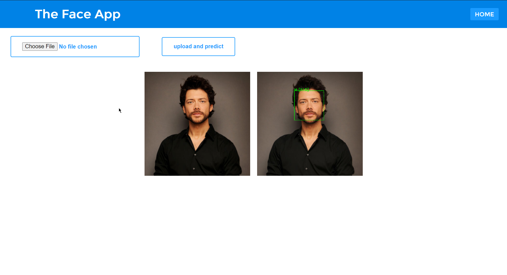
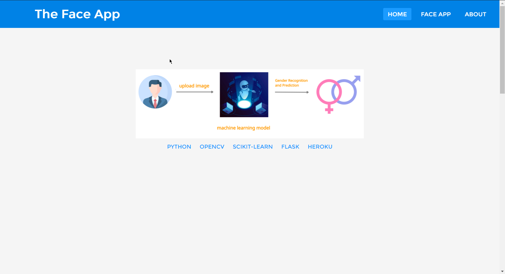

<p align="center">
  <a href="#">
    
  </a>

  <h3 align="center">Face Recognition and Gender Prediction</h3>
<br>

<details open="open">
  <summary>Table of Contents</summary>
  <ol>
    <li>
      <a href="#about-the-project">About The Project</a>
      <ul>
        <li><a href="#built-with">Built With</a></li>
      </ul>
    </li>
    <li>
      <a href="#getting-started">Getting Started</a>
      <ul>
        <li><a href="#prerequisites">Prerequisites</a></li>
        <li><a href="#installation">Installation</a></li>
      </ul>
    </li>
    <li><a href="#usage">Usage</a></li>
    <li><a href="#contact">Contact</a></li>
    <li><a href="#acknowledgements">Acknowledgements</a></li>
  </ol>
</details>

## About The Project

---



A web application that can recognize the gender and detect the face part from an image.

Here's why:

-   You shouldn't be just building the machine learning model in jupyter-notebook and save it to your SSD
-   Let the world see the power of AI

A list of commonly used resources that I find helpful are listed in the acknowledgements.

### Built With

---

-   [Python](https://www.python.org/)
-   [Scikit Learn](https://scikit-learn.org/)
-   [OpenCV](https://opencv.org/)
-   [Flask](https://flask.palletsprojects.com/)

## Getting Started

---

### Prerequisites

---

-   Python (3.7.x), Anaconda
-   VS Code, Microsoft

### Installation

---

1. Clone the repo
    ```sh
    git clone https://github.com/your_username_/Project-Name.git
    ```
2. Install Anaconda package
    ```sh
    conda env create -f environment.yml
    ```
3. Install VS Code Plugins
    ```JS
    Live Server
    Emmet
    Flask-Snippets
    ```

## Usage

---




## Contact

---

## Acknowledgements

---

-   [UI Color](https://uicolorpicker.com/) by [LOC](https://web.learncodeonline.in/)
-   [Wireframe](https://balsamiq.com/)
-   [Free AI Space](http://freeai.space/face-recognition)
-   [Medium Blog](https://medium.com/@freeai.space/build-face-recognition-app-in-flask-900cdd7632ed)
-   [Readme Editor](https://pandao.github.io/editor.md/index.html)
-   [GitHub Pages](https://pages.github.com)
-   [Font Awesome](https://fontawesome.com)
